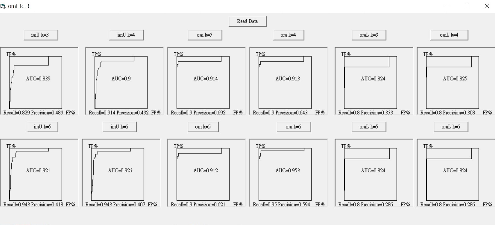

# Implement-K-Nearest-Neighbors-and-Plot-ROC-Curve-2018
Homework for the Data Mining course

## Introduction

The Graphical Interface of the Program.

## Notice
I learned and wrote in VB6 for this course.   
The code might be not neat enough,  but it demonstrates my ability to understand a  
machine learning model's theory, and to implement it logically using a new language.
